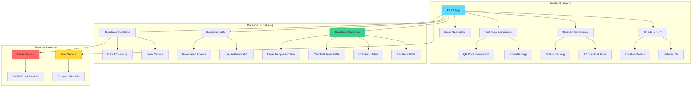
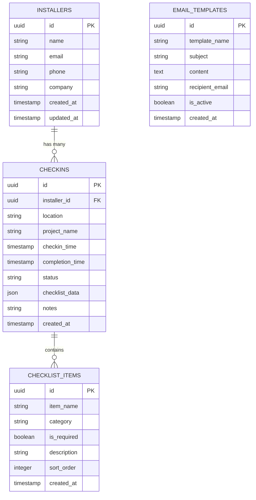
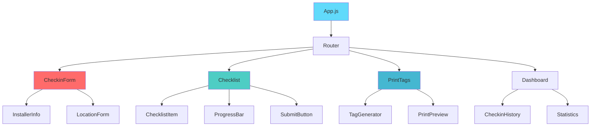
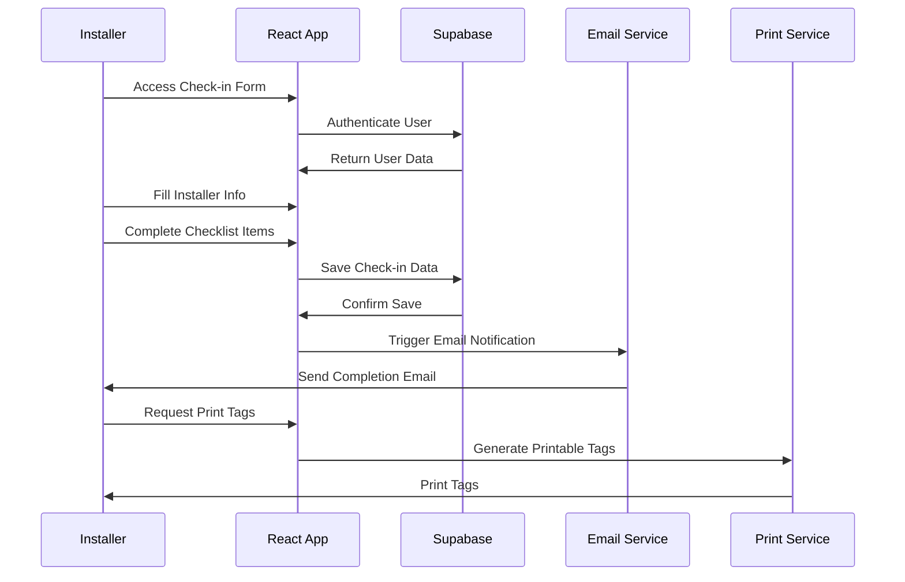

# Installer Check-in System Architecture

## System Overview
This React application allows installers to check in and complete a comprehensive checklist, with automatic email notifications and printable tags.

## Architecture Diagram

## Database Schema

## Component Structure

## Data Flow

## Technology Stack

### Frontend
- **React 18** - UI Framework
- **TypeScript** - Type Safety
- **Tailwind CSS** - Styling
- **React Router** - Navigation
- **React Hook Form** - Form Management
- **React Query** - Data Fetching
- **React Print** - Print Functionality
- **QR Code React** - QR Code Generation

### Backend (Supabase)
- **PostgreSQL** - Database
- **Row Level Security** - Data Protection
- **Edge Functions** - Serverless Functions
- **Real-time Subscriptions** - Live Updates
- **Storage** - File Uploads

### External Services
- **Email Service** - Nodemailer/SendGrid
- **Print Service** - Browser Print API
- **QR Code Generation** - QR Code Library

## Features Breakdown

### 1. Check-in Form
- Installer information collection
- Location and project details
- Real-time validation
- Auto-save functionality

### 2. Checklist System
- 17 customizable checklist items
- Progress tracking
- Required vs optional items
- Photo upload capability
- Notes and comments

### 3. Email Notifications
- Automatic completion emails
- Customizable templates
- Multiple recipient support
- PDF attachment capability

### 4. Print Functionality
- Printable check-in tags
- QR code generation
- Multiple format options
- Professional layout

### 5. Dashboard
- Check-in history
- Statistics and analytics
- Search and filter
- Export functionality

## Security Considerations
- Row Level Security (RLS) in Supabase
- JWT token authentication
- Input validation and sanitization
- HTTPS enforcement
- Rate limiting

## Performance Optimizations
- React.memo for component optimization
- Lazy loading for routes
- Image optimization
- Caching strategies
- CDN for static assets 